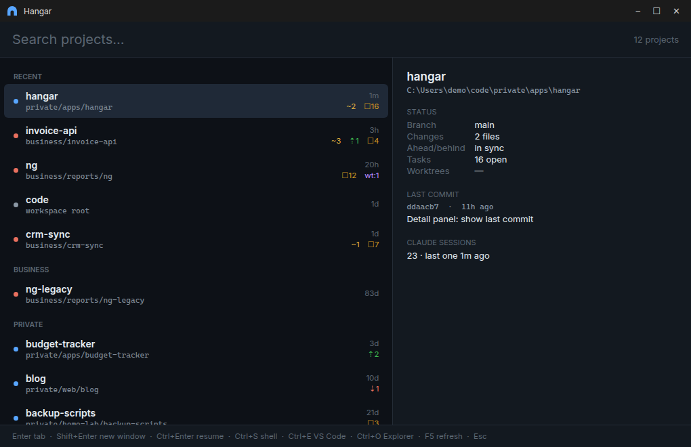
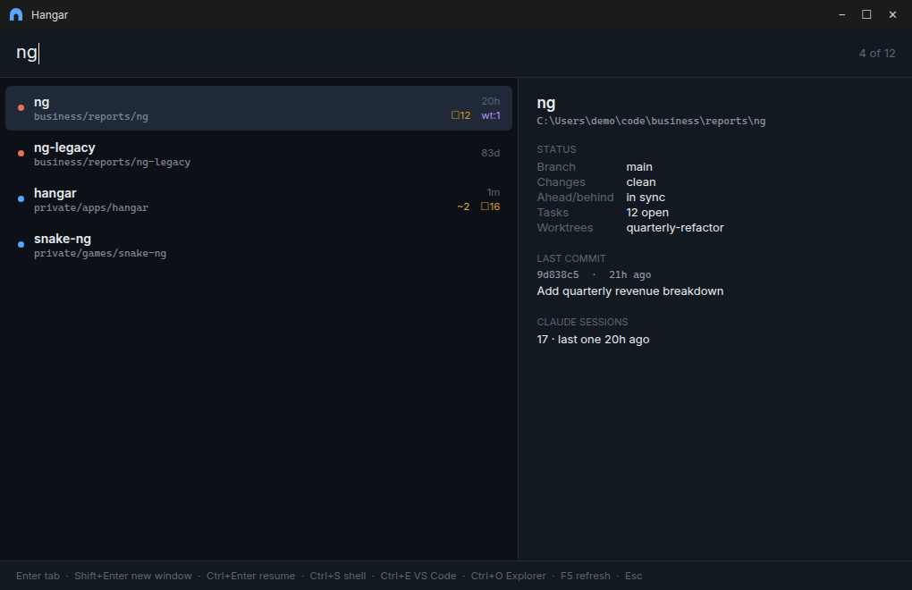
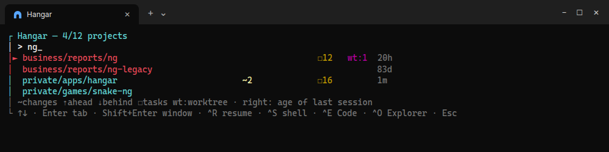

# Hangar

> From "I want to work on project X" to a running `claude` in the right folder in
> two seconds. Hangar knows every project in your workspace, ranks them by what you
> are actually working on, and opens a Windows Terminal tab with Claude Code
> already running.

A personal tool shared as is, with no warranty and no support. See [LICENSE](LICENSE).



> The images show a demo workspace. The terminal image is real picker output; the
> window images are rendered previews of the WPF layout filled with the same data.

## Requirements

- Windows 10/11
- [PowerShell 7](https://github.com/PowerShell/PowerShell) (`pwsh`)
- [Windows Terminal](https://github.com/microsoft/terminal) (`wt`)
- [Claude Code](https://claude.com/claude-code) (`claude` on `PATH`)
- Optional: VS Code (`code` on `PATH`) for the "open in editor" action

---

## Installation

1. Clone the repo, ideally next to your other projects:

   ```powershell
   git clone https://github.com/richardfaldyna-cell/hangar-launcher.git hangar
   ```

2. Tell Hangar where your projects live and add a `hangar` function to your
   PowerShell profile (`notepad $PROFILE`):

   ```powershell
   $env:HANGAR_ROOT = "$env:USERPROFILE\code"      # folder that contains your projects
   function hangar { & "$env:USERPROFILE\code\hangar\hangar.ps1" @args }
   ```

   If `HANGAR_ROOT` is not set, Hangar indexes the parent folder of its own checkout.

3. Optional: create desktop shortcuts (see [Desktop icons](#desktop-icons)).

### Configuration

| Environment variable | Meaning | Default |
|---|---|---|
| `HANGAR_ROOT` | workspace root that is scanned for projects | parent folder of the Hangar checkout |
| `HANGAR_MACHINE_PREFIX` | short machine label used in the Remote Control session address (`LAPTOP-myproject`) | `COMPUTERNAME` |

A **project** is any folder up to four levels below the root that contains `.git`
or `CLAUDE.md`. The root itself counts too when it is a repo.

Optional convention: projects under `business/` and `private/` in the root get their
own sections in the window and their own tab colour (red for `business`, blue for
everything else). All other projects go into the **OTHER** section.

---

## Usage

| Command | What it does |
|---|---|
| `hangar` | picker in the terminal (TUI) |
| `hangar ng` | **no UI at all**: launches the best match for "ng" right away |
| `hangar -Gui` | graphical window |
| `hangar ng -Gui` | window with the filter pre-filled with "ng" |
| `hangar -Refresh` | forces a fresh index before starting |
| `hangar ng -DryRun` | only prints what would be launched |

The fastest route is the one in the middle. If you know the project name, you need
no list: type `hangar ng` and press Enter.

### Desktop icons

```powershell
./install-shortcuts.ps1          # creates the shortcuts
./install-shortcuts.ps1 -Remove  # removes them again
```

This creates two shortcuts, **Hangar** (graphical window) and **Hangar (terminal)**.
Both use `img/hangar.ico`, which can be regenerated at any time with
`./make-icon.ps1`, even in another colour (`-Color '#C0392B'`). Right-click a
shortcut to pin it to the taskbar.

The graphical shortcut points to `hangar-gui.vbs`, not straight to `pwsh`.
PowerShell 7 has no windowless host, so even `-WindowStyle Hidden` briefly shows a
console window. The VBS shim never creates one.

---

## Graphical window: `hangar -Gui`

- **The order is not alphabetical.** At the top is the **RECENT** section: the five
  projects you are actually working on (frecency, see below). The rest is split into
  **BUSINESS / PRIVATE / OTHER** by location in the workspace. The dot on the left
  has the same colour the terminal tab will get.
- **One row = one project:** big name, path underneath. On the right: age of the last
  Claude session and status badges (`~changed files`, `⇡ahead`, `⇣behind`,
  `☐tasks from TODO.md`, `wt:worktrees`).

Typing filters the list. Focus always stays in the search box, and the arrow keys
work while you type.



- While searching, the sections are switched off and **the best match is always the
  first row**, so Enter needs no thought. An exact name beats substrings ("ng" finds
  the project `ng`, not `somethi-ng`).
- **Detail panel on the right:** branch, number of changes, ahead/behind, open tasks,
  worktrees, last commit (hash, age, subject) and how many Claude sessions the
  project has had.

### Window keys

| Key | Action |
|---|---|
| typing | filter (focus always stays in the search box) |
| ↑ ↓, PgUp/PgDn | selection in the list |
| **Enter** | `claude` in a new tab of the current WT window |
| **Shift+Enter** | `claude` in a new WT window |
| **Ctrl+Enter** | `claude --continue`: resumes the last conversation |
| **Ctrl+S** | plain shell, no claude |
| **Ctrl+E** | open in VS Code |
| **Ctrl+O** | open in Explorer |
| **F5** | refresh the index (runs in the background, the window does not freeze) |
| **Esc** | close |
| double-click | same as Enter |

---

## Terminal picker: `hangar`

The same data and the same actions, only in the console. Handy when you are already
in a terminal.



The keys match the window with two exceptions: resume is `Ctrl+R` (not Ctrl+Enter),
and `hangar -Refresh` replaces F5. The picker runs in the alternate screen buffer, so
**after Esc your original terminal content comes back**, history included.

Legend of the status columns (also applies to the badges in the window):

| Symbol | Meaning |
|---|---|
| `~3` | 3 changed/uncommitted files |
| `⇡2` | 2 commits not pushed yet (ahead) |
| `⇣1` | 1 extra commit on the server (behind) |
| `☐18` | 18 open tasks (`- [ ]`) in `TODO.md` |
| `wt:1` | 1 active worktree in `.claude/worktrees` |
| `6d` on the right | last terminal Claude session 6 days ago |

---

## How ranking works (frecency)

Every project launch through Hangar is written to `history.json`. A project's score is
the sum of the weights of all its launches, where the weight decays exponentially
with age. **The half-life is 10 days**, so a launch from 10 days ago weighs half as
much as one from today. On top of that comes 0.6× the weight of the last Claude
session, so the ranking already makes sense on a machine that has no history yet.
The result: what you are working on now is at the top, and projects untouched for a
month sink on their own. There is nothing to configure.

---

## Data and refresh

| File | What it is | Refresh |
|---|---|---|
| `index.json` | project catalogue + git status + sessions | generated by `hangar-index.ps1`. If it is older than 60 minutes, it is refreshed **in the background** (the picker never waits on git). Manually: `F5` / `-Refresh` |
| `history.json` | launch times for frecency | written on every project launch |

Both files are machine specific and therefore in `.gitignore`. Each machine keeps
its own.

---

## Troubleshooting

- **The tab has an unexpected font or colours:** Hangar could not find the WT
  profile. The look is inherited from the profile of the tab the picker runs in
  (`$env:WT_PROFILE_ID`), or from the default profile outside WT. Check that the
  profile exists in the WT settings.
- **The list shows stale data:** the index refreshes in the background, and the
  result only appears the next time the picker opens. In the window, just press `F5`.
- **"VS Code (`code`) is not on PATH":** `Ctrl+E` needs the `code` command
  (VS Code → `Shell Command: Install 'code' command in PATH`).
- **Question marks instead of `⇡⇣☐►`:** the picker switches its output to UTF-8
  and restores the encoding on exit. If they still appear, it is a bug. Please
  open an issue.
- **No projects found:** check `HANGAR_ROOT` and run `hangar -Refresh`. The index
  script prints how many projects it found.
- **Two sessions on the same project and Remote Control:** the second session does
  not register, because it would share the same address. This is a known limitation.

---

## Files in the repo

| File | Role |
|---|---|
| `hangar.ps1` | TUI picker + entry point (`-Gui` hands over to the window) |
| `hangar-gui.ps1` | graphical window (WPF) |
| `hangar-core.ps1` | shared core: index, search, frecency, launching |
| `hangar-index.ps1` | generator of `index.json` |
| `hangar-launch.ps1` | starts `claude` in the new tab (environment cleanup, `--name`, Remote Control) |
| `hangar-gui.vbs` | windowless launcher for the GUI shortcut |
| `install-shortcuts.ps1` | creates/removes the desktop shortcuts |
| `make-icon.ps1` | draws `img/hangar.ico` |
| `md2html.ps1` | renders a Markdown document (such as this README) to a standalone HTML file |

## License

[MIT](LICENSE)
